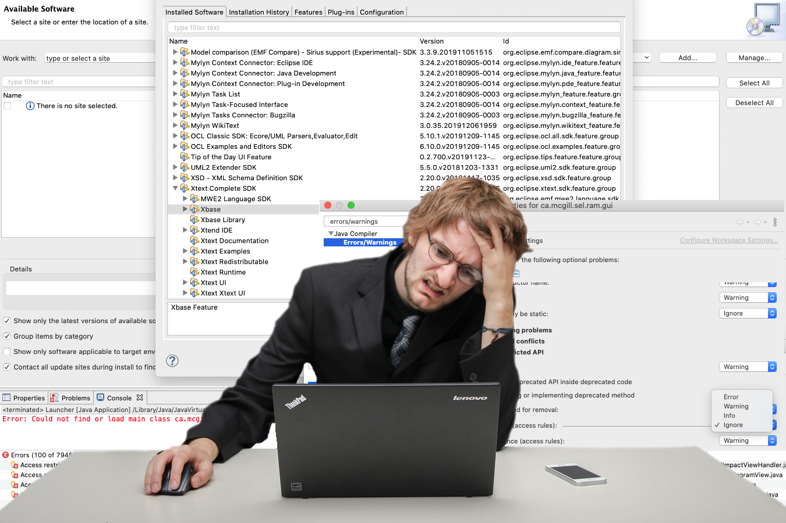

# TouchCORE Auto Dev Setup

*-Fast forwarding to the fun part!-*


## About

[TouchCORE](http://touchcore.cs.mcgill.ca/) is a multi-touch enabled software modeling tool, developed at McGill University.  
*This* repository hosts an [automated installer](touchcore-init) for an uncomplicated and reliable workstation setup. So you can spend more time *on the fun part*, such as meta-modeling...


## Again, why would I want that?

A working dev-environment for TouchCORE is subject to many implicit version constraints, such as the right Eclipse version, plugins, JDK and also IDE settings. A [manual configuration](https://bitbucket.org/mcgillram/touchram/wiki/getting-started) is time consuming and tedious...


*Image credits: [unsplash.com](https://unsplash.com/photos/oMpknr7yi7g)*

## Features

The auto-installer performs the identical steps as a [manual workstation setup](https://bitbucket.org/mcgillram/touchram/wiki/getting-started).

 * Install compatible Java version
 * Download [TouchCore sources](https://bitbucket.org/mcgillram/touchram/src/master/) into dedicated folder
 * Install compatible Eclipse-Modeling IDE
 * Install compatible Acceleo Eclipse-Plugin
 * Install compatible OCL Eclipse-Plugin
 * Install compatible Xtext Eclipse-Plugin
 * Install compatible Eclipse Checkstyle plugin
 * Auto configure eclipse / plugin settings
 * Import TouchCORE projects into workspace 

Furthermore, depending on your system and the required actions it may download additional tools, such as [brew](https://brew.sh/), [eclipse-CDT](https://www.eclipse.org/cdt/) and [wget](https://www.gnu.org/software/wget/).

*Note:* The installer modifies configuration files within the eclipse installation. This leads to a signature mismatch of the app. Depending on your system settings you may be asked for your password to override the MacOS integrity protection.

### Version Chart

Below chart indicates the exact software versions pulled by the auto-installer:

| Software | Version | Notes |
|---|---|---|
| Eclipse Modeling Version | 2020-09 | n/A |
| Java | 11.0.5 | Eclipse not compatible with more recent versions. |
| Acceleo | 3.7.10.202002210922 | n/A |
| OCL | 6.12.0.v20200608-1555 | n/A |
| Xtext | 2.23.0.v20200831-0926 | n/A |
| Checkstyle | 8.29.0.202001290016 | n/A |
| CDT | 10.0.0.202009071455 | n/A |
| Egit | 5.9.0.202009080501-r | n/A |

## Usage

**Warning:** This tool may overwrite existing eclipse installations and configurations. It is highly recommended to make a full system backup before usage.

 * ```./touchcore-init -h``` *Print usage / synopsis.*
 * ```./touchcore-init -p``` *Run a full installation in pretend mode. Only show what would be done, without actually modifying the system.*
 * ```./touchcore-init``` *Run a full installation. Request user confirmation before modifying the system.*
 * ```./touchcore-init -r``` *Repair eclipse. Does not hurt to run this from time to time. Does not touch code or plugins, but resets all caches / eclipse bloat files.*
 * ```./touchcore-init -c``` *Clean existing configurations / installation artifacts but do not touch the code. Request user confirmation before modifying the system.*

*Note:* The script was developed specifically for MacOS and will not work on other UNIX-like systems.

## Default locations

The auto installer places files at specific locations. It will only search and detect existing installation artifacts, if the following conventions are respected:

 * *Eclipse, Modeling Version* installed at ```/Applications/Eclipse\ Modeling.app/```
 * *Sources* at ```~/Code/core/``` and ```~/Code/touchram/```
 * *Eclipse workspace* at ```~/touchcore-workspace/```

## Author / Pull requests

Maximilian Schiedermeier  
first.last@mcgill.ca
